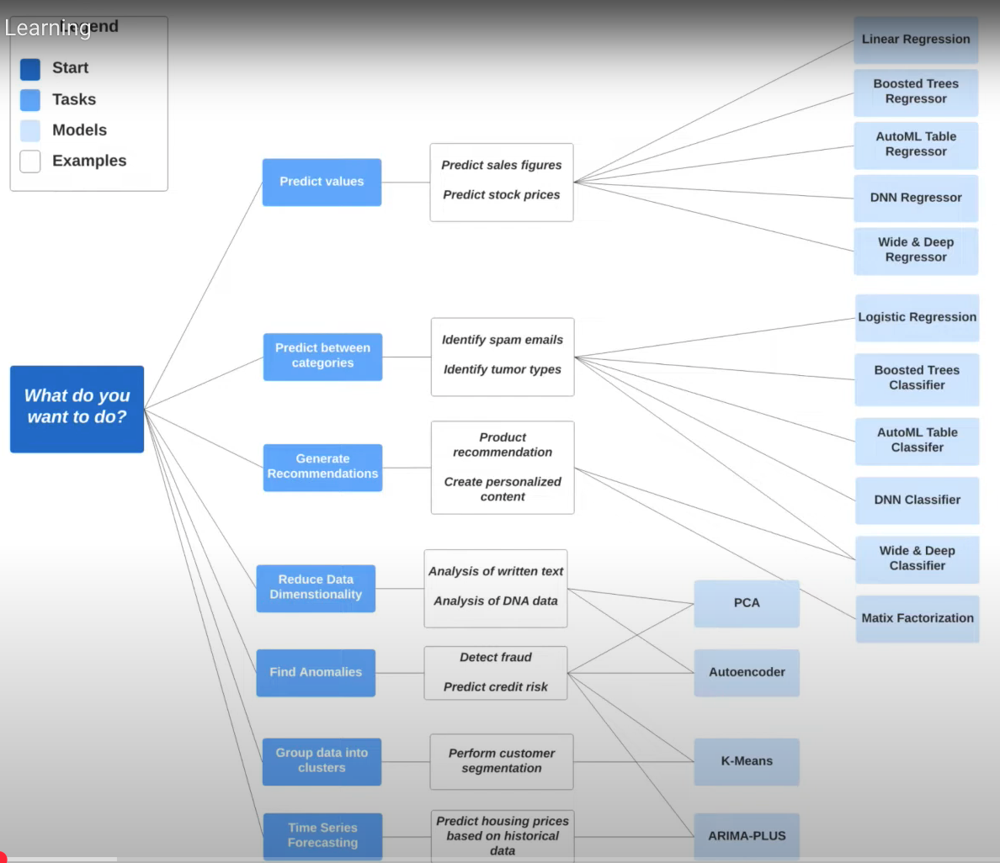

## OLTP and OLAP
### OLTP (Online Transaction Processing)
OLTP refers to systems designed to handle a large number of short, real-time transactions. These sytems are optimized for fast insert, update and delete operations, and they prioritize data integrity and consistency.

1. Purpose: manage day-to-day transactional data
1. Operations: read and write (e.g. insert, update, delete)
1. Data Volume: handles small amount of data per transactions but processes a large number of transations. 
1. Speed: prioritize fast, real-time processing
1. Normalization: highly normalized to avoid data redundancy and ensure data consistency

### OLAP (Online Analytics Processing)
OLAP refers to systems designed for complex analytical queries and reporting. These systems aggregate large volumes of historical data to provide insights and support decision-making.

1. Purpose: analyze data for business intelligence and decision-making
2. Operations: handle complex read-heavy queries (e.g. aggregations, joins, and data slicing)
3. Data Volume: Processes large volumes of historical data
4. Speed: prioritize query performance
5. Denormalization: apply denormalized structures like star or snowflake schemas for faster queries.

## Normalization and Denormalization 
### Normalization
Data is split into multiple realted tables. Each table focuses on a single subject
1. Reduced redundancy: avoid duplications across tables
2. Improved consistency

### Denormalization
Data from multiple tables is consolidated into fewer tables or a single table, often including duplicated data to reduce the need for complex joins and improve query performance.
1. Faster Reads
2. Simpler Queries: data is stored in a flat structure, making it easier to query.

## ML Algorithm Diagram


## Additional Notes
### Assign More Resource to Task
```python
BashOperator(
        task_id="taskB",
        bash_command="sleep 30",  # 假设 taskB 耗时较长
        resources={"cpus": 2, "memory": 2048},  # 分配更多资源
    )
```
### Pass Parameters from Main Dag to Sub Dag
Main DAG
```python
# 用TriggerDagRunOperator唤醒Sub Dag
trigger_sub_dag = TriggerDagRunOperator(
            task_id=f'trigger_subdag_{year}',
            trigger_dag_id='sub_dag',
            # 在conf里定义year参数
            conf={'year': year},  # 传递年份参数
            wait_for_completion=True
        ) 
```
Sub DAG
```python
def parse_year(**kwargs):
    # 解析主 DAG 传递的年份参数
    dag_run_conf = kwargs['dag_run'].conf
    # 获取year value, 如果不存在返回unknown
    year = dag_run_conf.get('year', 'unknown')
    return year

parse_year_task = PythonOperator(
        task_id="parse_year",
        python_callable=parse_year,
        provide_context=True
    )
```
### `**kwargs` and `context` in Airflow
`**kwargs`可接受的参数类型:
- 动态参数
- 用户自定义参数
- Airflow运行时自动提供的参数
- 参数结构为key-value, 简单的dict结构
- 不确定参数数量
`context`可接受的参数类型:
- 固定参数
- 用户自定义参数
- Airflow运行时自动提供的参数
- 参数结构可以为key-value, 也可以是key-class, key-list, key-json
- Airflow规定的参数, 比如callback